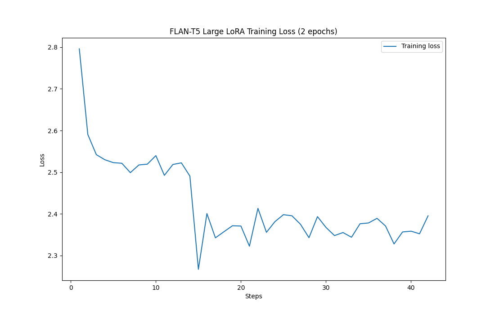
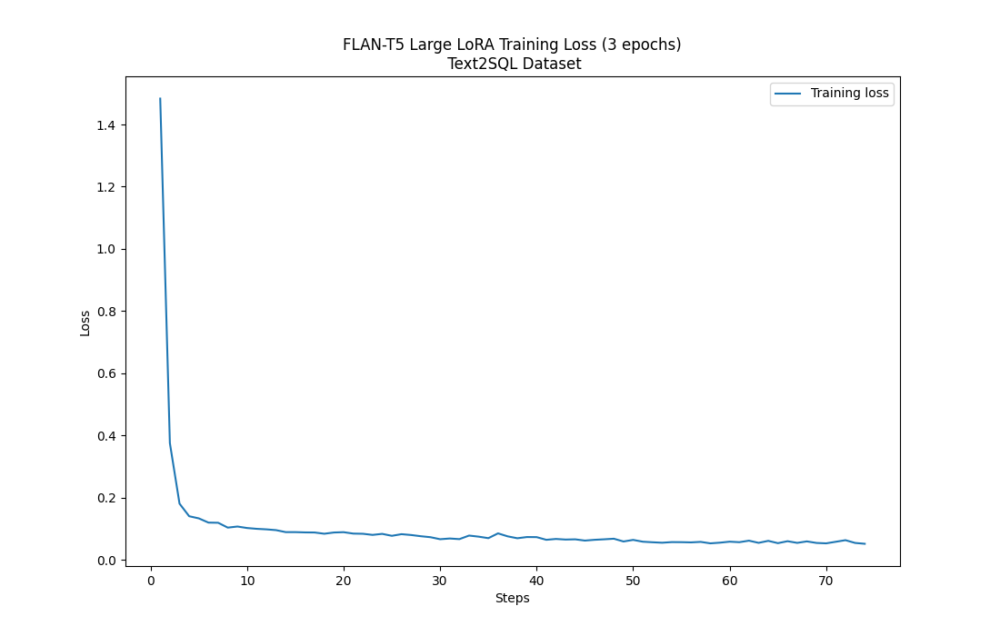
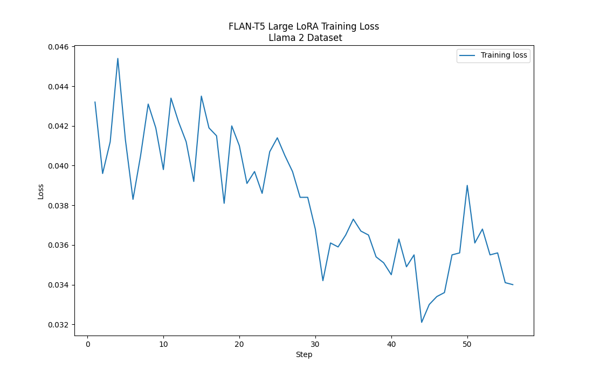
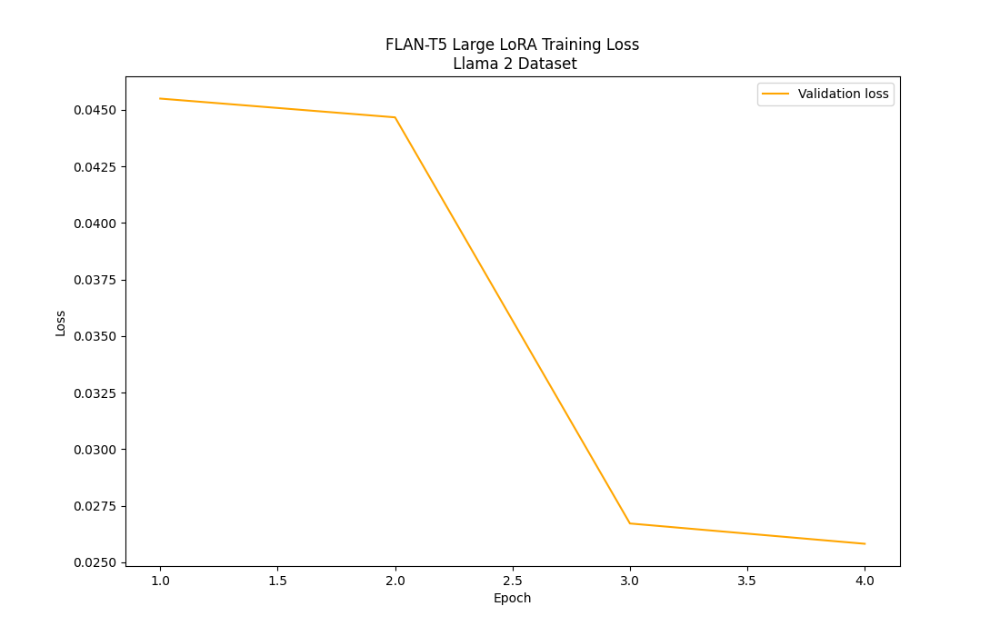

# FINE-TUNING

## Details

Model was fine-tuned on the [finance-alpaca](https://huggingface.co/datasets/gbharti/finance-alpaca) dataset, rows that were longer than 512 tokens (instruction + context) were truncated.

Training was done locally on my PC on GTX 1080Ti 12GB VRAM using Low Rank Adaptation ([LoRA](https://arxiv.org/pdf/2106.09685.pdf)) method, it took approximately 7 hours for one epoch with LLM weights set to bfloat16, batch size was set to the value that will maximally utilize GPU memory.

After some tests I decided to use FLAN-T5-large because perfomance "out of the box" (without fine-tuning) was better than FLAN-T5-base after fine tunning with LoRA.

### Financial QA task

#### Training loss curve



```cpp
Training data shape: (43441, 2)
Test data shape: (4827, 2)
Memory footprint of FLAN-T5-large with LoRA layers: 1.60 GB
Trainable parameters 9,437,184 || All parameters 792,587,264 || Trainable parameter percentage: 1.19%
```

#### Rouge scores

|| Rouge-1 | Rouge-2 | Rouge-L | Rouge-Lsum |
|---|---------|---------|---------|---------|
| LoRA Model | 0.2899 | 0.1144 | 0.2285 | 0.2286 |
| Base Model | 0.1131 | 0.0352 | 0.0966 | 0.0963 |

### Text to SQL task

Dataset used for fine-tunning to generate SQL queries from text was [Text2SQL](https://huggingface.co/datasets/b-mc2/sql-create-context). Thanks to smaller number of tokens (mostly < 100) in the context I was able to run training for 3 epochs on my GPU, training took approximately 6 hours.

#### SQL-CREATE-CONTEXT dataset

##### Training loss curve (Text2SQL)



|| Rouge-1 | Rouge-2 | Rouge-L | Rouge-Lsum |
|---|---------|---------|---------|---------|
| LoRA Model | 0.9879 | 0.9879 | 0.9879 | 0.9879 |
| Base Model | 0.2554 | 0.1066| 0.2200 | 0.2200 |

#### Llama-2-SQL-dataset

Model weights achieved in the previous fine-tuning on the dataset mentioned above were used to further fine-tune and imporve model's ability to generate SQL queries from text. Dataset used for this task was [Llama-2 SQL](https://huggingface.co/datasets/ChrisHayduk/Llama-2-SQL-Dataset).

##### Training loss curve (Llama-2 SQL Dataset)



##### Validation loss curve (Llama-2 SQL Dataset)



|| Rouge-1 | Rouge-2 | Rouge-L | Rouge-Lsum |
|---|---------|---------|---------|---------|
| LoRA Model | 0.9931 | 0.9832 | 0.9909 | 0.9909 |
| Base Model | 0.1912 | 0.0771 | 0.1775 | 0.1777 |

## Future work

- Further fine-tuning to summarize financial articles and chat with users.
